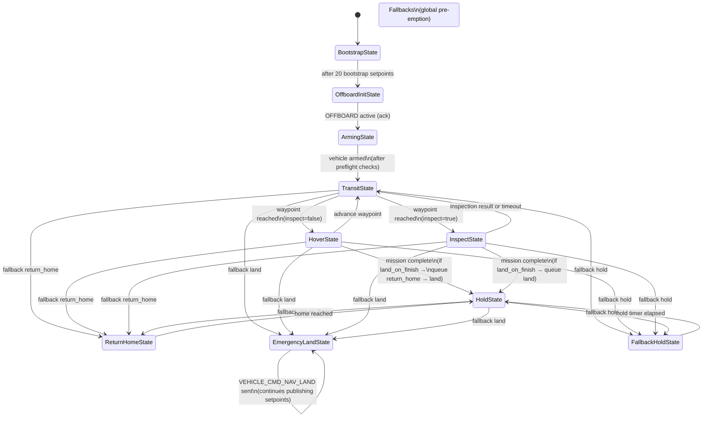

# ShelfScout PX4‑ROS2 Digital Twin
This README describes ShelfScout PX4‑ROS2 Digital Twin's architecture (SSDT), setup workflow, launch procedure, and troubleshooting guidance for contributors.

## Overview
OverRack Scan is an indoor PX4 SITL + Gazebo Classic sandbox that exercises a ROS 2 mission runner, perception node, and metrics pipeline against shelf-inspection scenarios. The repository provides the Gazebo world, PX4 model patches, mission YAML language, and orchestration scripts needed to reproduce full-stack simulations headless or with a GUI.

## Architecture at a Glance
```
PX4 SITL (gazebo-classic_iris_opt_flow)
    ↕  UDP 2019/2020 (uORB <-> RTPS)
Micro XRCE-DDS Agent (udp4 -p 8888)
    ↕  DDS QoS (Fast DDS / XRCE)
ROS 2 Workspace (ros2_ws)
    ├─ overrack_mission.mission_runner  → publishes Offboard setpoints
    ├─ overrack_mission.inspection_node → emits inspection events
    └─ overrack_mission.metrics         → exports KPI CSV files
```
- The `MissionStateMachine` enforces TAKEOFF → TRANSIT → HOVER/INSPECT → HOLD, applies tolerance windows, and triggers fallback actions (`return_home`, `hold`, `land`, etc.).
- `inspection_node.py` watches camera frames and mission state, marks each waypoint as `OK`, `SUSPECT`, or `LOW_LIGHT`.
- `metrics_node.py` records mission phases, fallback reasons, and inspection verdicts into `data/metrics/` for offline review.

## Repository Layout
| Path | Description |
| --- | --- |
| `ros2_ws/src/overrack_mission/` | Primary ROS 2 package (mission runner, mission engine, perception, metrics, planning utilities). |
| `ros2_ws/src/px4_msgs`, `px4_ros_com` | PX4-official message and bridge packages; kept pristine for compatibility. |
| `config/` | Mission YAML files and optional PX4 parameter overrides. |
| `routes/` | Pre-computed trajectory templates (e.g., `overrack_default.yaml`). |
| `worlds/`, `models/` | Gazebo Classic indoor world plus the custom rack and drone assets. |
| `scripts/` | Launchers (`run_ros2_system.sh`, `launch_px4_gazebo.sh`), debug helpers, and env file. |
| `data/` | Runtime artefacts: `logs/`, `metrics/`, `images/`. |
| `docs/` | Mission language reference, bridge details, structure review, and archived notes. |

## Environment Setup
### Prerequisites (reference versions)
- Ubuntu 22.04 LTS with ROS 2 Humble installed (`ros-humble-desktop` 0.10.0-1jammy.20250916.062930) and `colcon`.
- PX4-Autopilot `v1.14.4` (local fork; see `$SSDT_PX4_DIR`, built via `make px4_sitl_default`).
- Micro XRCE-DDS Agent `v2.4.3` (binary exported via `$SSDT_MICRO_XRCE_DIR`).
- Gazebo Classic `11.10.2` (`gazebo` / `gzserver` on PATH).
- Python `3.10.12` + `pip` (create a virtual environment if you need isolated tooling).

### Workspace Preparation
1. Copy `scripts/.env.example` to `scripts/.env` and adjust the SSDT variables (`SSDT_PX4_DIR`, `SSDT_ROS_WS`, `SSDT_AGENT_CMD`, etc.) so they point to your PX4 checkout, ROS workspace, and preferred defaults.
2. (Optional) create a virtual environment for the auxiliary scripts:
   ```bash
   python3.10 -m venv .venv
   source .venv/bin/activate
   pip install --upgrade pip
   pip install -r requirements.txt
   ```
3. Build the ROS 2 workspace if you wish to iterate manually:
   ```bash
   cd ros2_ws
   colcon build --symlink-install --packages-select px4_msgs overrack_mission
   source install/setup.bash
   ```
4. Ensure PX4 SITL models and this repository are on `GAZEBO_MODEL_PATH`. The launch scripts append both automatically, but you can export them manually if needed:
   ```bash
   export GAZEBO_MODEL_PATH="$PX4_DIR/Tools/simulation/gazebo-classic/sitl_gazebo-classic/models:$(pwd)/models:${GAZEBO_MODEL_PATH:-}"
   ```

### Env profile
The ShelfScout Digital Twin (SSDT) profile lives in `scripts/.env` and is sourced by every launcher. The file:
- Defines all input/output paths (`SSDT_PX4_DIR`, `SSDT_ROS_WS`, `SSDT_WORLD`, `SSDT_LOG_DIR`, ...), so you only update one place when moving the workspace.
- Exposes helpers (`ssdt_resolve_path`, `ssdt_source_ros`, `ssdt_prepend_path`) that launchers reuse instead of duplicating ROS sourcing logic or PATH edits.
- Ships with legacy aliases (`PX4_DIR`, `MICRO_XRCE_AGENT_DIR`) to remain compatible with older scripts until they are migrated.

Always `source scripts/.env` before manual commands, or let the provided scripts do it for you. To refresh your setup, edit `scripts/.env` (or start from `scripts/.env.example`) and re-run the launch script.

### Mission / world / agent defaults
Mission content and simulator defaults live in `ros2_ws/src/overrack_mission/overrack_mission/param/sim.yaml`:
- `run_ros2_system.ros__parameters.world_file` — Gazebo world used by PX4 SITL.
- `run_ros2_system.ros__parameters.agent_cmd` — command line passed to the Micro XRCE-DDS agent.
- `mission_runner.ros__parameters.mission_file` — mission YAML parsed by the ROS node (see `docs/mission_v1.md`).
- `torch_controller.ros__parameters.*` — topic `overrack/torch_enable` bridged to inspection events; includes `startup_on` and `min_on_seconds` (minimum ON dwell after `LOW_LIGHT` before honoring `OK`).
Change those paths once in the YAML and re-run `scripts/run_ros2_system.sh`; no CLI overrides or env tweaks are necessary anymore.

> **When to rebuild `ros2_ws`**
> - Any change under `ros2_ws/src/**` (Python nodes, launch files, msgs) or edits to `setup.py` / `package.xml` require `colcon build --symlink-install`.
> - Run the build manually, then `source ros2_ws/install/setup.bash` before invoking `scripts/run_ros2_system.sh` again. The script only auto-builds when `install/setup.bash` is missing.

| Component            | Version / Tag                         | Notes |
| -------------------- | ------------------------------------- | ----- |
| ROS 2 Humble         | `ros-humble-desktop` 0.10.0-1jammy…   | `dpkg -s ros-humble-desktop` |
| PX4-Autopilot        | `v1.14.4-dirty`                       | `git describe` in `$SSDT_PX4_DIR` |
| Micro XRCE-DDS Agent | `v2.4.3`                              | built from `$SSDT_MICRO_XRCE_DIR` |
| Gazebo Classic       | `11.10.2`                             | `gazebo --version` |
| Python               | `3.10.12`                             | `python3 --version` |
| colcon-core          | `0.20.0`                              | `python3 -m importlib.metadata` |
| colcon-ros           | `0.5.0`                               | same as above |
| colcon-cmake         | `0.2.29`                              | same as above |
| colcon-bash          | `0.5.0`                               | same as above |

## Launch with `run_ros2_system.sh`
Use the orchestrator from the repository root to start PX4, Gazebo, the Micro XRCE-DDS Agent, and all ROS 2 nodes:

```bash
./scripts/run_ros2_system.sh --gui      # use --headless for CI or SSH
```
`run_ros2_system.sh` now refuses every other CLI flag on purpose: the world file, mission file, and XRCE agent command are loaded from `ros2_ws/src/overrack_mission/overrack_mission/param/sim.yaml` (`run_ros2_system.ros__parameters` and `mission_runner.ros__parameters`). Edit that YAML to choose a different mission/world/agent and rerun the script—no more long command lines or env overrides. (The script parses the YAML via PyYAML, so keep `python3 -m pip install pyyaml` handy.)

The script performs the following:
- Verifies and (re)builds `ros2_ws` if needed.
- Reads `param/sim.yaml` to resolve `world_file`, `mission_file`, and `agent_cmd`, then launches PX4 SITL + Gazebo via `scripts/launch_px4_gazebo.sh`.
- Starts the Micro XRCE-DDS Agent exactly as declared in the YAML and tails its log to `data/logs/micro_xrce_agent.out`.
- Runs `ros2 run overrack_mission mission_runner --ros-args --params-file <sim.yaml>` logging to `data/logs/mission_runner.out`.
- Streams PX4 output to `data/logs/px4_sitl_default.out` for later inspection.

If you ever need to kill everything quickly, `scripts/stop_manual_like.sh` still terminates PX4, Gazebo, the agent, and the mission runner.

### Torch light plugin (Gazebo Classic)
- Build the C++ plugin once with `colcon build --symlink-install --packages-select overrack_light_plugin overrack_mission` and re-source `ros2_ws/install/setup.bash`.
- Ensure `GAZEBO_PLUGIN_PATH` includes `ros2_ws/install/lib` (already set in `scripts/.env.example`); Gazebo will load `libtorch_light_plugin.so` from the SDF.
- The plugin listens to `std_msgs/Bool` on `/overrack/torch_enable`; `torch_controller` bridges `OVERrack/inspection` events (`LOW_LIGHT`/`OK`) to that topic so the light mounted on the drone can be toggled at runtime.

## Mission Runner and ROS 2 Nodes
- **Mission Runner (`nodes/mission_control_node.py`)**: loads the YAML plan supplied via `mission_file`, instantiates the ROS-free `MissionController`, and publishes Offboard setpoints at 20 Hz once PX4 reports readiness while co-spinning the inspection node.
- **Mission Core**: `core/controller.py`, `core/plan.py`, `core/fsm.py`, and `core/planning/` translate mission plans into PX4 topic interactions. Modes include `explicit` waypoint execution, `precomputed` route playback (from `routes/*.yaml`), and `coverage` patterns generated by the planner.
- **PX4 adapters**: `px4io/setpoints.py`, `px4io/telemetry.py`, and `px4io/qos.py` centralise QoS profiles, telemetry subscriptions, and command publishers. Every waypoint remains ENU in the mission files; the adapters convert to PX4’s NED frame (with yaw expressed in degrees → radians), subtract the spawn offset learned from the first odometry sample, and clamp the command to your declared `world_bounds` so the drone never exits the indoor volume.
- **Inspection (`nodes/inspection_node.py`)**: subscribes to `sensor_msgs/Image` (configurable `image_topic`) and mission state updates to label each inspection stage as `OK`, `SUSPECT`, or `LOW_LIGHT`.
- **Metrics (`nodes/metrics_node.py`)**: listens to mission states and inspection events, counts fallback occurrences, and writes summary + per-inspection CSV artefacts into `data/metrics/` at shutdown.
The ROS 2 package is registered through `ros2_ws/src/overrack_mission/setup.py`, which wires the entry points above so `colcon build` exposes `mission_runner`, `inspection_node`, and `mission_metrics` as console scripts after installation. See `docs/mission_v1.md` (“Mission Runner Internals”) for a deep dive into the state machine, yaw conventions, and parameter schema.

### Mission Runner parameters (sim)
`ros2 launch overrack_mission mission.sim.launch.py mission_file:=config/mission1.yaml` remains the quickest way to start the stack. That launch file feeds `param/sim.yaml`, which now exposes:
- `mission_file`: YAML plan (still overridable via `mission_file:=...`).
- `world_bounds.{x,y,z}` (meters in NED): rectangular safety limits mirrored into ENU for plan validation; every waypoint outside these numbers causes a load-time failure, and every PX4 setpoint is clamped to the same box after the spawn-offset correction.
- `cruise_speed_limits`: `[min, max]` guard rails checked against `cruise_speed_mps`.
- `debug_frames`: when `true`, each waypoint prints one `FrameDebug[...]` line with ENU target, NED target, applied offset, current PX4 pose, and yaw.
- `return_home_safe_z`: (meters ENU) safe altitude used by the return-home fallback to climb above indoor obstacles before translating home.

The inspection node keeps its `image_topic`, `low_light_threshold`, and QoS wired to the shared `EVENTS_QOS`. An archived RTAB-Map launch now lives under `launch/experimental/` so it stays available without cluttering the default mission launch.

## Data, Logs, and Analysis Tools
- `data/logs/` collects PX4, agent, mission runner, and auxiliary script logs for regression tracking.
- `data/metrics/` stores missions KPI CSVs (duration, fallback counts, inspection outcomes).
- `data/images/` holds camera captures for post-mission analysis or barcode decoding.
- `scripts/run_vision.py` and `scripts/run_visual_demo.py` provide optional visualisation/analytics entry points.

## FSM

> **Notes:**  
> - Fallback triggers (`battery_warning`, `battery_critical`, `link_lost`, `low_light`) are evaluated **globally every tick** and may pre-empt *any* state. The arrows below show the common sources, but pre-emption is not limited to them.  
> - `increase_hover` does not change state; it just extends the hover window.  
> - FSM ticks start only after `MissionController._check_spawn_sync_ready()` sees spawn offset + EKF pose.




## Troubleshooting
- **Offboard rejected**: confirm at least 20 trajectory setpoints are streamed before `VehicleCommand.DO_SET_MODE`, and verify `vehicle_status.nav_state` plus pre-flight checks via `px4io/telemetry.py` helpers.
- **Unexpected drift / “drone leaves the room”**: enable `debug_frames:=true` to log a single ENU/NED/offset/local snapshot per waypoint and double-check your `world_bounds`.
- **PX4 battery failsafe overrides**: if you want the FSM to manage battery fallbacks, set PX4 `COM_LOW_BAT_ACT` to `Warning` (or raise thresholds) so PX4 does not auto-RTL/land; see `px4_param_setter` in `sim.yaml` for scripting this.
- **No `/fmu/out/*` topics**: check `data/logs/micro_xrce_agent.out` for agent crashes, ensure the PX4 branch matches the agent binary, and confirm UDP ports 2019/2020 are free.
- **Fallback not firing**: ensure triggers in the mission YAML match published event names (e.g., `battery_warning`, `low_light`) and monitor `overrack/inspection` output.
- **Gazebo refuses to start**: rebuild PX4 (`make px4_sitl_default`), try `--headless`, and verify that `GAZEBO_MODEL_PATH` contains both PX4 and OverRack models.
  

### PX4 + Gazebo Classic startup quirk (race condition)

We observed that sometimes Gazebo Classic starts (process is up, port is open) but PX4’s `sitl_run.sh` tries to spawn the vehicle model too early, right after `gzserver` is launched. In those runs the PX4 log stops at:

```text
[px4] Using: /.../models/iris_opt_flow/iris_opt_flow.sdf
````

and nothing else happens.

This is a small timing issue: `gzserver` is running, but it has not finished loading the world and plugins yet, so the CLI call

```bash
gz model --spawn-file=... --model-name=...
```

returns “An instance of Gazebo is not running.” and the flow looks stuck.

#### Workaround we applied

We patched PX4’s `Tools/simulation/gazebo-classic/sitl_run.sh` to give Gazebo a short grace period **after** starting `gzserver` and **before** spawning the model:

```bash
gzserver $verbose $world_path $ros_args &
SIM_PID=$!

# ... resolve modelpath ...

echo "Using: ${modelpath}/${model}/${model}.sdf"

# [BEGIN Customization]
sleep 4 # give gazebo a moment to finish loading plugins/world
# [END Customization]

while gz model --verbose --spawn-file="${modelpath}/${model}/${model_name}.sdf" \
  --model-name=${model} -x 1.01 -y 0.98 -z 0.83 2>&1 | \
  grep -q "An instance of Gazebo is not running."; do
  echo "gzserver not ready yet, trying again!"
  sleep 1
done
```

We noticed that running the same script from an SSH / VS Code remote shell sometimes worked, probably because the environment was a bit slower, which unintentionally gave Gazebo the extra time, or gazebo needed less time to fully initialize because the gzclient would not be started.

#### Why we document it here

* the ROS 2 workspace, Micro XRCE agent and mission runner were fine;
* the flakiness was specifically in the PX4 + Gazebo Classic launch path;
* keeping the explanation close to the launch instructions will help anyone who sees “stuck at ‘Using: …iris_opt_flow.sdf’” and thinks PX4 is broken.


but the default is: put it right after the PX4 + Gazebo section so operators will actually see it.

- **Known PX4 + Gazebo Classic startup quirk**: occasionally `gzserver` accepts connections before the world is fully initialised, so PX4’s `gz model --spawn-file=...` call fails with “An instance of Gazebo is not running.” Patch `PX4-Autopilot/Tools/simulation/gazebo-classic/sitl_run.sh` to add a short delay after starting `gzserver` (e.g., `sleep 4`) and retry the spawn loop until it succeeds. This prevents runs getting stuck after printing `Using: .../iris_opt_flow.sdf` and matches the workaround already applied in our local PX4 fork.


### Drone spawns in a different point / diagonal takeoff

#### Symptoms

- In Gazebo the Iris model is spawned near the shelves, not at the world origin.
- PX4 odometry still starts at NED (0, 0, 0).
- When starting a mission the vehicle:
  - arms and enters OFFBOARD,
  - but the initial motion is a low **diagonal drift** instead of a clean vertical climb.
- In older logs the first `Bootstrap setpoint` lines already show **non-zero** ENU X/Y.

#### Root cause (frames & spawn offset)

Mission waypoints are defined in the **map/world ENU frame**, while PX4 flies in its **local NED frame**.

When the drone does not spawn at ENU (0, 0), there is a non-zero **spawn offset** between those frames.  
If that offset is subtracted too early (during takeoff), PX4 tries to reach a target that already includes the offset, which results in a diagonal move very close to the ground.

#### How the stack handles it now

1. **Spawn offset sync (Gazebo ↔ PX4)**

   - `Telemetry` subscribes to `/gazebo/model_states` and detects the pose of the configured `gazebo_model` (e.g. `iris_opt_flow`).
   - In a background thread it queries Gazebo:
     - `/gazebo/get_entity_state` **or**
     - `/gazebo/get_model_state`
   - The spawn position is cached as:

     ```text
     spawn_offset_enu = (x, y, z)   # in the Gazebo world frame
     ```

   - `MissionController._check_spawn_sync_ready()` blocks the FSM until:

     - spawn sync state is `READY` (or a timeout/failure is reached),
     - a valid PX4 local position is available (`local_position().xy_valid == True`),
     - `spawn_offset_enu` is non-null.

   - While waiting, the controller logs messages such as:

     - `Waiting for Gazebo model detection before capturing spawn offset...`
     - `Waiting for Gazebo spawn offset (query in flight)...`
     - `Waiting for EKF local position...`
     - `Waiting for PX4 to publish initial odometry pose...`

   - When everything is ready you should see:

     ```text
     Spawn offset fetched from Gazebo (...): ENU (x=..., y=..., z=...)
     [DEBUG] Spawn offset synced: Gazebo=(..., ..., ...)
     Gazebo spawn offset and EKF pose ready; proceeding with TAKEOFF bootstrap
     ```

2. **Pure vertical takeoff (bootstrap phase)**

   - While the FSM is in `BootstrapState`, `OffboardInitState` and `ArmingState` it does **not** fly mission waypoints.
   - Instead it uses `MissionContext.bootstrap_position_enu()` which returns:

     ```text
     (0.0, 0.0, plan.altitude_m)
     ```

   - `SetpointPublisher` runs in `bootstrap_mode = True`, so `_prepare_target()` ignores `spawn_offset_enu` and only applies the ENU→NED rotation:

     ```text
     ENU (0.0, 0.0, ALT)  ->  NED (0.0, 0.0, -ALT)
     ```

   - The first 20 `TrajectorySetpoint`s therefore form a **pure vertical climb** in PX4’s local frame (no horizontal motion).  
     In the logs you should see, for the whole bootstrap phase:

     ```text
     Bootstrap setpoint N/20 -> ENU(0.00, 0.00, ALT) NED(0.00, 0.00, -ALT)
     ```

   - Only after OFFBOARD is active and the vehicle is ARMED does the FSM leave the bootstrap states.

3. **Switching to map-aligned waypoints**

   - On the first transition **out of** `BootstrapState` / `OffboardInitState` / `ArmingState`, the FSM calls:

     ```python
     ctx.mark_bootstrap_complete()
     setpoints.set_bootstrap_mode(False)
     ```

   - From that moment on:

     - `MissionContext.target_position_enu` comes from the mission plan (map/world ENU).
     - `SetpointPublisher._prepare_target()` now **subtracts** `spawn_offset_enu` before converting to NED:

       ```text
       local_enu = enu_position - spawn_offset_enu
       NED       = (local_enu.y, local_enu.x, -local_enu.z)
       ```

   - Effectively:
     - The entire takeoff leg is a **local-frame vertical climb**.
     - Once the drone is safely at `plan.altitude_m`, the controller starts applying the ENU spawn offset and moves horizontally over the rack according to the mission waypoints.

#### If things still look wrong

- **Check the Gazebo model name**

  Make sure the `gazebo_model` argument in `Telemetry` matches the actual entry in `/gazebo/model_states` (e.g. `iris`, `iris_opt_flow`, etc.).

- **Check the spawn-offset logs**

  You should see a line like:


  Spawn offset fetched from Gazebo (/gazebo/get_entity_state): ENU (x=1.01, y=0.98, z=0.05)
  Gazebo spawn offset and EKF pose ready; proceeding with TAKEOFF bootstrap


If not, the controller is probably still waiting for Gazebo or for PX4 odometry.

* **Make sure the takeoff altitude is high enough**

  Set `plan.altitude_m` (or the first step’s Z) to something like 2–3 m so that the first horizontal motion happens well above the ground.

* **Return-home goes to the “wrong” origin**

  By default `ReturnHomeState` flies to `plan.home_position` in ENU.
  If your drone spawns away from ENU (0, 0), and you want the **return-home** fallback to go back to the actual spawn point, set `home_position` in the mission YAML to the X/Y printed in the spawn-offset log, for example:

  ```yaml
  home_position: [1.01, 0.98]  # ENU X/Y of the drone spawn
  ```

  `ReturnHomeState` will then command a hover above that ENU position at the mission altitude.

### Light Plugin Development (Troubleshooting Notes)

During development of the drone-mounted torch light, several approaches were tested before reaching the final, reliable solution.  
Here is a short summary of the process.

#### 1. Initial Attempts: Local Rendering Tricks
```c++
// OLD APPROACH (client-side only)
if (on)
{
    light_->SetDiffuseColor(ignition::math::Color(1, 0.95, 0.8, 1));
    light_->SetSpecularColor(ignition::math::Color(0.3, 0.3, 0.3, 1));
    light_->SetAttenuation(1.0, 0.1, 0.01);
}
else
{
    light_->SetDiffuseColor(ignition::math::Color(0, 0, 0, 1));
    light_->SetSpecularColor(ignition::math::Color(0, 0, 0, 1));
    light_->SetAttenuation(0.0, 1.0, 1.0);
    light_->SetRange(0.01);
    light_->SetVisible(false);
    light_->SetCastShadows(false);
}
```

The first implementation tried to “turn off” the light by modifying client-side rendering properties:

- setting the diffuse/specular color to black  
- tweaking attenuation values  
- reducing the range  
- hiding the light with `SetVisible(false)`

Although the plugin correctly reacted to ROS messages, Gazebo Classic continued to render a bright glow on nearby surfaces.  
This happened because these methods only update the *client-side OGRE rendering*, while the *lights themselves are managed on the server side*.  
As a result, the visual appearance never fully matched the intended ON/OFF state.

#### 2. Observed Issue
Even when logs showed the plugin entering the OFF branch, the world still contained an active spotlight.  
The drone appeared to be emitting light even though the rendering parameters were set to zero.  
This confirmed that we were modifying the “viewer”, not the actual light entity in the world.

#### 3. Final Working Approach: Server-Side Light Control
The definitive solution was to stop manipulating rendering properties directly and instead use **Gazebo’s official light control interface**: /world/<world_name>/light/modify
```c++
// NEW APPROACH (client + server)

/* 1) Client-side update (OGRE) */
if (on)
{
    light_->SetDiffuseColor(ignition::math::Color(1, 0.95, 0.8, 1));
    light_->SetSpecularColor(ignition::math::Color(0.3, 0.3, 0.3, 1));
    light_->SetAttenuation(1.0, 0.1, 0.01);
    light_->SetRange(20.0);
    light_->SetVisible(true);
    light_->SetCastShadows(true);
}
else
{
    light_->SetDiffuseColor(ignition::math::Color(0, 0, 0, 1));
    light_->SetSpecularColor(ignition::math::Color(0, 0, 0, 1));
    light_->SetAttenuation(0.0, 1.0, 1.0);
    light_->SetRange(0.01);
    light_->SetVisible(false);
    light_->SetCastShadows(false);
}

/* 2) Server-side authoritative update */
msgs::Light msg;
msg.set_name(scoped_light_name_);
msg.set_cast_shadows(on);
msg.set_range(on ? 20.0 : 0.01);

auto *diff = msg.mutable_diffuse();
if (on)
{
    diff->set_r(1.0); diff->set_g(0.95); diff->set_b(0.8); diff->set_a(1.0);
}
else
{
    diff->set_r(0.0); diff->set_g(0.0); diff->set_b(0.0); diff->set_a(1.0);
}

light_pub_->Publish(msg);
```


Through a `gazebo::msgs::Light` message, the plugin now sends authoritative updates to the world state.  
This method modifies the real light entity, not just the local viewport.

When switching **OFF**, the plugin sends:

- a server-side light update with the scoped name  
- `range` set to a near-zero value  
- shadow casting disabled  
- visibility disabled  

When switching **ON**, the plugin restores the intended spotlight parameters (range, attenuation, diffuse color, shadows).

Because the update is applied by the server, the renderer and the physics world stay fully synchronized.

#### 4. Takeaway
Client-side modifications (OGRE color, attenuation hacks, visibility flags) are not sufficient to reliably disable a light in Gazebo Classic.

Using the official  
`/world/<world>/light/modify`  
interface was the key to achieving consistent ON/OFF behavior for the drone's torch light in PX4 + ROS2 simulation.

## Troubleshooting – Transparent Roof Without Sunlight
Gazebo Classic cannot make a roof both visually transparent and sunlight-proof via material alone. The renderer applies the material only to the visual mesh, while the directional sun lights the world through the collision mesh, so a thin or transparent roof still leaks sun.

**What we saw**
- Indoor scene was unrealistically bright.
- LOW_LIGHT trigger was unreliable because ambient sun dominated.
- Neon lights had little visible effect.

**Fix**
- Remove the global sun entirely:
  ```xml
  <!-- Sun disabled: its light interferes with indoor lighting -->
  <!--
  <include>
    <uri>model://sun</uri>
  </include>
  -->
  ```
- Keep the transparent roof visual for top-down debugging:
  ```xml
  <visual name="vis">
    <geometry><box><size>12 10 0.1</size></box></geometry>
    <material>
      <script>
        <uri>file://../models/materials/scripts/custom.material</uri>
        <name>Custom/AlphaBlend</name>
      </script>
      <ambient>1 1 1 0.1</ambient>
      <diffuse>1 1 1 0.1</diffuse>
    </material>
  </visual>
  ```
- Light the room with indoor spotlights (neons) only.

**Result**
- Roof stays visually transparent for debugging (we can observe what is happening inside the room), but no external sun leaks in.
- Illumination comes solely from controlled indoor lights and the torch.
- LOW_LIGHT behaves deterministically without ambient drift.

## How AI was used in this project
- The markdow is almost fully IA written, of course is carefully checked by the developer, but checking is faster than starting writing from zero.
The integratex visualstudio code chatbot is used, becouse allow the develper to carefully check the diff between a previous version of the document and the newone propose by the IA.

## Documentation Index
| Document | Purpose |
| --- | --- |
| `docs/mission_v1.md` | Authoritative mission YAML schema (api_version 1) with defaults, modes, triggers, and examples. |
| `docs/mission_v1_backup.md` | Legacy snapshot of the mission language kept for reference. |
| `docs/ROS2_PX4_BRIDGING.md` | Details on the PX4 ↔ Micro XRCE-DDS ↔ ROS 2 bridge, message flows, and troubleshooting. |
| `docs/structure_review.md` | Component inventory and status (active vs legacy/zombie subsystems). |
| `docs/README_legacy.md` | Historical notes preserved for completeness; not actively maintained. |
