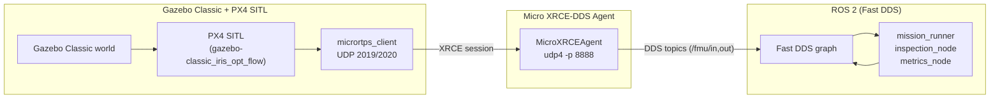

# PX4 ↔ ROS 2 Bridging
This document explains the PX4 ↔ Micro XRCE-DDS ↔ ROS 2 bridge used in the project, including message flows, agent settings, and troubleshooting steps.

## Architecture
The bridge translates PX4 uORB messages into ROS 2 topics via Micro XRCE-DDS. It is the only ROS/DDS touchpoint; the rest of the architecture is covered in `docs/architecture.md`.



- PX4 builds and launches `micrortps_client` alongside SITL; it serialises uORB topics over UDP ports 2019 (TX) and 2020 (RX).
- `MicroXRCEAgent` translates those UDP frames into DDS XRCE sessions on port 8888. Multiple ROS 2 participants can subscribe via Fast DDS once the agent is running.
- ROS 2 nodes built against `px4_msgs` publish to `/fmu/in/*` topics and subscribe to `/fmu/out/*`, matching PX4 QoS (`BEST_EFFORT`, depth 1).

## Component Responsibilities
- **PX4 SITL**: started through `scripts/launch_px4_gazebo.sh`. The relevant binaries live in `PX4_DIR/build/px4_sitl_default/` and include the generated `micrortps_client`.
- **Micro XRCE-DDS Agent**: either installed system-wide or referenced through `MICRO_XRCE_AGENT_DIR`. `scripts/run_ros2_system.sh` spawns it with the command supplied in `config/sim/default.yaml` (overridable via env; default `MicroXRCEAgent udp4 -p 8888 -v 6`).
- **ROS 2 Workspace (`ros2_ws`)**: houses `px4_msgs`, `px4_ros_com`, and `overrack_mission`. After sourcing `ros2_ws/install/setup.bash`, any ROS 2 node can interact with PX4 topics using the shared message definitions.

## Bridge Lifecycle
1. `scripts/launch_px4_gazebo.sh` starts PX4 with `micrortps_client` enabled so PX4 emits RTPS frames on 2019/2020.
2. `scripts/run_ros2_system.sh` launches the agent with the command from `config/sim/default.yaml` (`ssdt.agent_cmd`) and tails its output to `data/logs/micro_xrce_agent.out`.
3. Once the agent establishes the XRCE session, Fast DDS discovery exposes `/fmu/in/*` and `/fmu/out/*` to the ROS graph. `mission_runner` waits for `/fmu/out/vehicle_status` before entering Offboard.
4. If PX4 updates add or remove topics, rebuild PX4 (`make px4_sitl_default`) so the generated `micrortps_client` and `px4_msgs` stay in sync.

## Message Flows
### PX4 → ROS 2 (`/fmu/out/*`)
| Topic | Description | Notes |
| --- | --- | --- |
| `/fmu/out/vehicle_local_position` | Position, velocity, reference frame data | Consumed by `px4io/telemetry.py` for state transitions. |
| `/fmu/out/vehicle_status` | Arming state, nav state, failsafes | Used to gate Offboard requests and detect link issues. |
| `/fmu/out/battery_status` | Voltage, percentage, warning bits | Drives fallback triggers (`battery_warning`, `battery_critical`). |
| `/fmu/out/vehicle_attitude` | Quaternion orientation | Optional; useful for perception alignment. |
| `/fmu/out/trajectory_setpoint` | Echoed setpoints for verification | Helpful for debugging mission scripts. |

### ROS 2 → PX4 (`/fmu/in/*`)
| Topic | Publisher | Purpose |
| --- | --- | --- |
| `/fmu/in/offboard_control_mode` | `MissionController` | Keeps PX4 in position-control Offboard mode. |
| `/fmu/in/trajectory_setpoint` | `MissionController` | Publishes position/yaw commands at 20 Hz. |
| `/fmu/in/vehicle_command` | `MissionController` | Sends `DO_SET_MODE`, `COMPONENT_ARM_DISARM`, and fallback commands (e.g., land). |
| `/fmu/in/vehicle_command` | `metrics_node`/others | May inject additional commands (e.g., land on finish). |

All OverRack Scan publishers follow the PX4 recommendation of sending setpoints for at least 1 s before arming or switching to Offboard. QoS profiles mirror PX4 defaults (`BEST_EFFORT`, `depth=1`) to avoid incompatibilities.

> **Frame conversions.** Mission plans remain ENU-centric. The `px4io/setpoints.py` adapter converts each command into PX4’s NED frame, converts yaw from degrees to radians, subtracts the spawn offset captured from the first `/fmu/out/vehicle_local_position`, and clamps the result to the configured `world_bounds`. The same helper is reused both for publishing and debugging so what you log is exactly what PX4 receives.

## Agent Command Options and Ports
The agent command is passed directly to `run_ros2_system.sh --agent-cmd`. Common options:

```bash
MicroXRCEAgent udp4 -p 8888 -v 6            # default verbose UDP agent
MicroXRCEAgent udp4 -p 11888 -r 2020 -s 2019 # override listening port and remote PX4 ports
MicroXRCEAgent serial -d /dev/ttyUSB0 -b 921600 -v 4 # for hardware tests
```

Key ports:
- **2019/2020**: PX4 SITL ↔ `micrortps_client` UDP pair. Ensure they are free before launching.
- **8888**: Micro XRCE-DDS Agent control port (XRCE sessions). Change it when running multiple agents on the same host.
- **Fast DDS discovery**: uses standard ROS 2 multicast; no extra configuration is required unless the network is firewalled.

When adjusting ports, keep them aligned across PX4 (`micrortps_client -t UDP -r <PX4_RX> -s <PX4_TX>`) and the agent command (`-r`, `-s` flags) so that both directions match.

## Launch Path Summary
1. `scripts/launch_px4_gazebo.sh` runs `make px4_sitl_default gazebo`, which starts `gzserver`, `gzclient` (optional), and PX4 SITL with `micrortps_client`.
2. `run_ros2_system.sh` expands `GAZEBO_MODEL_PATH`, spawns the Micro XRCE-DDS Agent, and injects the chosen command via `--agent-cmd`.
3. After sourcing `ros2_ws/install/setup.bash`, the script launches `mission_runner`, `inspection_node`, and `metrics_node` (same executor) that read/write the PX4 topics listed above.

## Troubleshooting
- **Agent starts but no ROS 2 topics appear**: confirm PX4 and `px4_msgs` are built from the same PX4 release. A mismatch in message definitions silently drops samples. Rebuild `px4_msgs` after updating PX4.
- **`MicroXRCEAgent` exits immediately**: check for port conflicts on 8888 or invalid `--agent-cmd` syntax. Use `MicroXRCEAgent udp4 -p 8888 -v 6 --refs` to list active sessions.
- **Missing `/fmu/out/*` topics while PX4 runs**: inspect `data/logs/micro_xrce_agent.out` for “Session not created” errors and ensure the PX4 SITL instance exposes UDP 2019/2020 (firewalls can block localhost UDP on some setups).
- **ROS 2 publishers rejected**: Offboard control requires at least 10–20 setpoints before `VehicleCommand`. Monitor `mission_runner` logs to verify the timing, and confirm QoS mismatches are not forcing `INCOMPATIBLE_QOS` warnings (run `ros2 doctor --report`).
- **Agent and PX4 version drift**: regenerate Micro XRCE-DDS agent sources via `make px4_sitl_default` whenever PX4 is updated; stale agents often miss newly added topics, leading to “unknown topic id” spam.

Keep `data/logs/px4_sitl_default.out` and `data/logs/micro_xrce_agent.out` under version control for complex debugging sessions—they capture the precise port numbers, topic IDs, and QoS status negotiated during a run.
