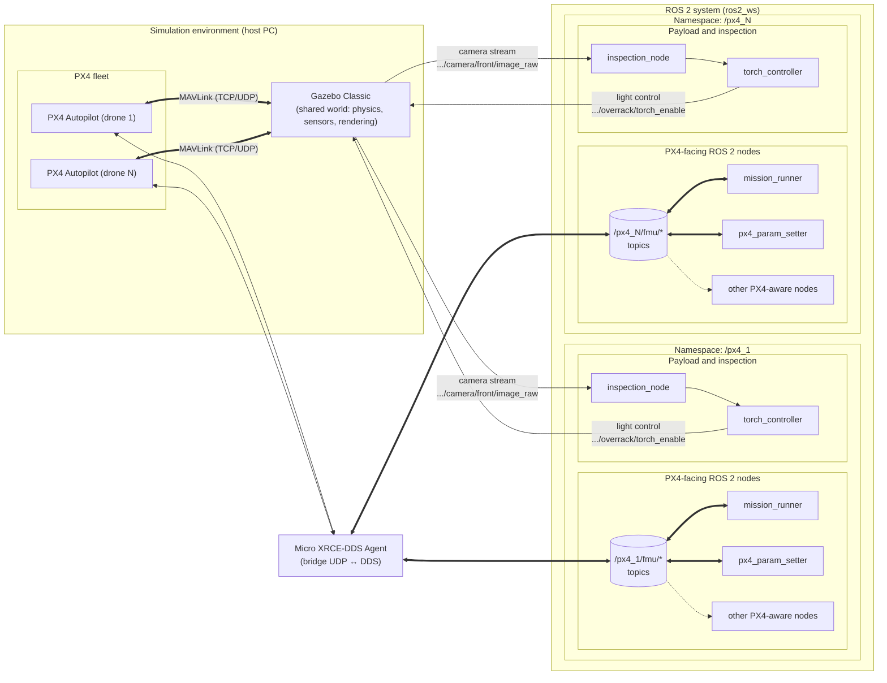
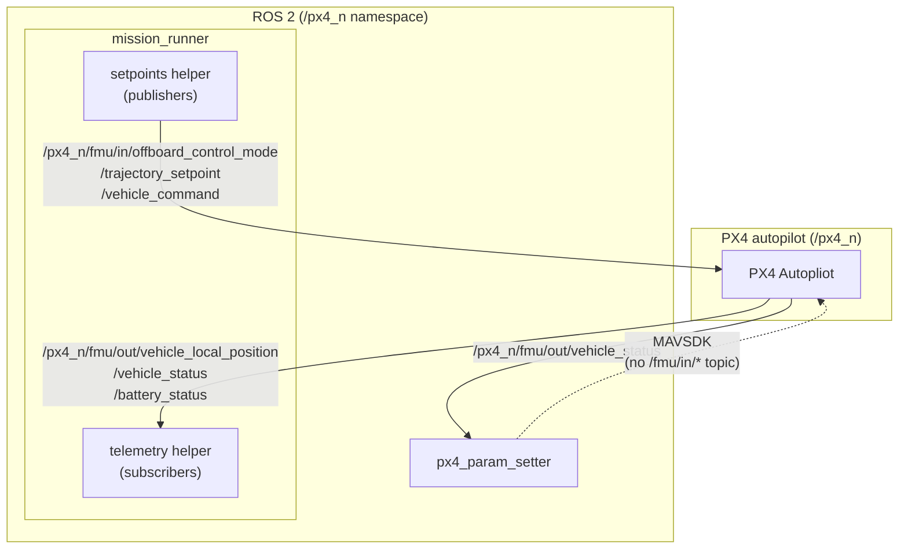

<!-- Scope: high-level architecture for the current single-drone stack. Multi-drone notes are included as outlook only. -->

# Architecture

OverRack Scan runs PX4 SITL inside a Gazebo Classic world and drives it with ROS 2 nodes. A Micro XRCE-DDS bridge keeps PX4 and ROS 2 in sync; the bridge internals live in `docs/uxrce_dds_px4_ros_bridge.md`. The focus here is how the project is structured and how the pieces are wired together for the single-drone pipeline. (we need to abstract)

**Read this first:** if you need a conceptual overview of PX4, Gazebo, and ROS 2/DDS before diving deeper, start with [docs/foundations.md](docs/foundations.md).

### PX4 facing ROS2 nodes

`mission_runner` is the only ROS node here; it embeds two helpers: `telemetry` (subscribes to `/fmu/out/*`) and `setpoints` (publishes to `/fmu/in/*`). `px4_param_setter` listens to `/fmu/out/vehicle_status` to detect PX4 STANDBY and then uses MAVSDK (over MAVLink) to push parameters directly to the autopilot, bypassing the `/fmu/in/*` bus.*¹

¹ MAVSDK is limited to parameter push/edge cases because building a MAVSDK backend would force us to re-implement the arbitration, queuing, and conflict-resolution logic that DDS/ROS 2 already routes through the mission runner suite; see [ROS 2 bridge](uxrce_dds_px4_ros_bridge.md). for the full explanation.

## Stack Overview (single drone)
- Simulation: Gazebo Classic world + PX4 SITL model chosen from `config/sim/default.yaml` (defaults to `worlds/overrack_indoor.world` and `iris_opt_flow` unless overridden via env/params).
- Bridge: Micro XRCE-DDS Agent (`MicroXRCEAgent udp4 ...` by default) exposes `/fmu/in/*` and `/fmu/out/*` on DDS.
- ROS 2 nodes per vehicle: `mission_runner` (telemetry + setpoints helpers), `inspection_node`, `mission_metrics`, `torch_controller`; `px4_param_setter` optionally pushes parameters via MAVSDK/MAVLink once PX4 reaches STANDBY.
- Outputs: logs under `data/logs/` (PX4, Gazebo, micro_xrce_agent, mission_runner), metrics CSVs under `data/metrics/`, images/snapshots under `data/images/`.

## Runtime Flow
This section is a high-level summary of the orchestrator; for CLI flags, env resolution, and logging paths see `docs/run_system.md`.
1. `scripts/run_system.sh` (multi-first) loads `scripts/.env`, resolves paths (`PX4_DIR`, ROS workspace), and reads the param YAML (`config/sim/multi_1drone.yaml` by default; falls back to `config/sim/multi.yaml`). The legacy `run_ros2_system.sh` still exists for the old single-path flow.
2. Derives world, mission file, agent command, and `drones` list via `param_utils`; builds the ROS 2 workspace if needed and sources the chosen ROS distro.
3. Starts PX4 + Gazebo via `launch_px4_gazebo_multi.sh`, with `--headless` if requested.
4. Starts the Micro XRCE Agent with the resolved command and waits for `/fmu/out/vehicle_status` and `/fmu/out/vehicle_local_position` to appear.
5. Launches `ros2 launch overrack_mission mission.sim.launch.py params_file:=<...> mission_file:=<...>`, which spins up (per namespace) `mission_runner`, `inspection_node`, `mission_metrics`, `torch_controller`, and `px4_param_setter` using the same params file/overrides.

## Models and PX4 airframes
- Gazebo loads the SDF model you pick (e.g., `models/iris_opt_flow/iris_opt_flow.sdf`), while PX4 flies an airframe selected by `PX4_SIM_MODEL` (mapped in `launch_px4_gazebo_multi.sh`). Keep those aligned: motor layout, mass/inertia, and sensor plugins in the SDF should match what the chosen airframe expects.
- Custom models can live under `models/<name>/<name>.sdf.jinja`. Ensure `GAZEBO_MODEL_PATH` includes `models/`, extend the PX4 `sitl_multiple_run.sh` whitelist for `<name>`, and map it to an appropriate PX4 airframe (or add a new one in PX4) so the control stack remains stable.
- If you change prop layout or mass, update both the SDF and the PX4 airframe constants; mismatches show up as EKF instability or sluggish control.

## Data 
- Metrics, inspection logs, and snapshots are written under `data/metrics/` and `data/images/`; PX4/agent/mission logs go to `data/logs/`.
