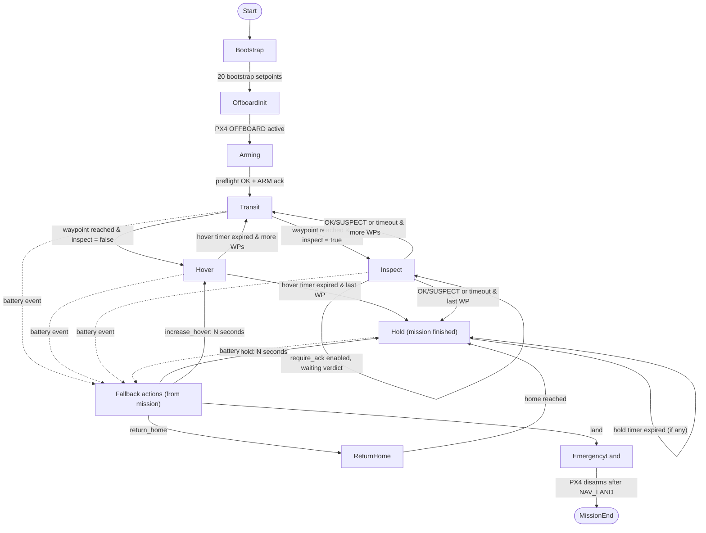

<!-- Source of truth: ros2_ws/src/overrack_mission/overrack_mission/core/fsm.py -->

# Mission FSM

Current single-drone state machine as implemented in `core/fsm.py`. Battery triggers start the mission-defined fallback action queue; `return_home_and_land_on_finish:true` appends `return_home` + `land` after the last waypoint.

## State semantics
- **Bootstrap**: publishes the initial hover setpoint (0,0,alt) for 20 ticks to let PX4 stabilise.
- **OffboardInit**: sends `VEHICLE_CMD_DO_SET_MODE` once; waits until PX4 reports Offboard active.
- **Arming**: waits for preflight checks, sends `ARM` once, then advances when PX4 reports armed.
- **Transit**: drives toward the current waypoint setpoint; when within XY/Z tolerances, schedules hover time and jumps to `Hover` or `Inspect` depending on `step.inspect`.
- **Hover**: holds position until the hover deadline elapses, then advances to next waypoint or `Hold`. If `return_home_and_land_on_finish:true`, queues `return_home` + `land` when the final waypoint completes.
- **Inspect**: same setpoint as hover. If `inspection.require_ack=true`, waits for `OK`/`SUSPECT` from `/overrack/inspection` or for `inspection.timeout_s`. Otherwise, advances when hover time expires. `LOW_LIGHT` is ignored by the FSM (handled by torch control only).
- **Hold**: maintains the last target (or return-home target if set). Used after mission completion or when a `hold:N` fallback action is running.
- **ReturnHome**: multi-phase climb/translate/descend to home XY/Z (with optional `return_home_safe_z`). Completes in `Hold` at home.
- **EmergencyLand**: sends `NAV_LAND` once and waits for PX4 to disarm, then enters `MissionEnd`.
- **MissionEnd**: terminal no-op.

## Fallback handling and priorities
- Triggers polled each tick: `battery_warning` and `battery_critical`. They are latched per trigger. Priority map: `battery_critical` (3) > `battery_warning` (1) > internal (-1). Higher priority can override a running sequence; same trigger does nothing.
- When a trigger activates and has configured actions in the mission file, a **fallback sequence** starts (queue of actions). If `battery_critical` fires with no configured actions, it defaults to a single `land`.
- Actions are executed in order:
  - `return_home` → transition to `ReturnHome`.
  - `land` → transition to `EmergencyLand`.
  - `hold:<seconds>` → sets a hold timer in `Hold`.
  - `increase_hover:<seconds>` → extends current hover window, no state change.
  - Unknown actions are skipped with a warning.
- `return_home_and_land_on_finish:true` enqueues `return_home` then `land` when the final waypoint completes (before entering `Hold`).

## Inspection events and mission actions
- During `Inspect`, only `OK`/`SUSPECT` satisfy `require_ack`; `LOW_LIGHT` is ignored for FSM decisions.
- When a waypoint has `action` (e.g., `snapshot`), the FSM publishes that string to `/overrack/mission_state` at the transition out of `Hover` or `Inspect`; it does not alter state. Metrics and inspection nodes consume the event.
- Why show `Inspect` if we don’t branch on verdict value? It gates progression (waits for an ack/timeout when `require_ack=true`), defines the hover window for sensing/actions, and exposes clear state/logging so downstream nodes (torch, metrics, inspection) can align their work. Verdict content affects those consumers, while the FSM only needs “some verdict arrived or we timed out” to move on.

## Behaviors outside the mission FSM
- PX4 link-loss failsafe is owned by PX4: if Offboard setpoints/heartbeats stop (or you simulate link loss), PX4 executes its native failsafe (`NAV_DLL_ACT` controls the behavior and can be set in the PX4 param YAML; see https://docs.px4.io/main/en/advanced_config/parameter_reference), independent of the mission FSM.
- PX4 battery failsafe can also be left to PX4, but we force `COM_LOW_BAT_ACT=0` in our configs to prevent PX4 from overriding the mission fallback actions.
- Torch and metrics reactions are downstream of inspection and mission_state events (`LOW_LIGHT`/`OK`/`SUSPECT`, `snapshot`) and do not drive mission state transitions.
