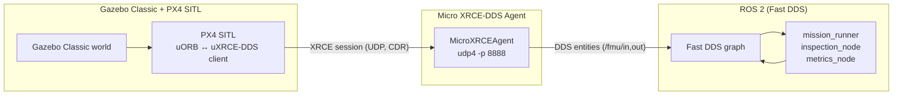
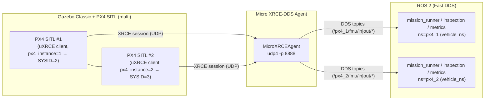

# PX4 ↔ ROS 2 Bridging
This document explains the PX4 ↔ Micro XRCE-DDS ↔ ROS 2 bridge used in the project, including message flows, agent settings, and troubleshooting steps.

## Architecture
The bridge translates PX4 uORB messages into ROS 2 topics via Micro XRCE-DDS. It is the only ROS/DDS touchpoint; the rest of the architecture is covered in `docs/architecture.md`.



- PX4 builds and launches the uXRCE-DDS client alongside SITL; it serialises uORB topics into an XRCE session and connects to the agent.
- `MicroXRCEAgent` translates the XRCE session into DDS entities on port 8888. Multiple ROS 2 participants can subscribe via Fast DDS once the agent is running.
- ROS 2 nodes built against `px4_msgs` publish to `/fmu/in/*` topics and subscribe to `/fmu/out/*`, matching PX4 QoS (`BEST_EFFORT`, depth 1).

## Multi-drone architecture (default)
The multi path keeps a single agent and multiple PX4 clients, while ROS 2 nodes are namespaced per vehicle. It is driven by `run_system.sh --params config/sim/multi.yaml` (or `config/sim/multi_1drone.yaml` for one drone using the same flow).



- **PX4 instances**: `launch_px4_gazebo_multi.sh` (called by `run_system.sh`) uses `sitl_multiple_run.sh` to spawn one PX4 per drone with unique SYSID/MAVLink ports and its own uXRCE client.
- **Agent**: one `MicroXRCEAgent` on the configured port (default 8888). Each PX4 client opens its own XRCE session; multiple agents are optional (set `agent_cmd` per drone with distinct `-p` if you need isolation).
- **ROS 2 namespaces**: `mission.sim.launch.py` wraps each drone in `PushRosNamespace(ns)` where `ns` comes from `vehicle_ns`/`namespace` in the YAML (`px4_1`, `px4_2`, ...). Node names are suffixed (`mission_runner_px4_1`, etc.) to avoid clashes.
- **PX4 topic prefix**: parameters `px4_namespace` optionally prepend a PX4 prefix to `/fmu/*` (left empty by default because the bridge exposes `/fmu/...` without namespace). Publishers/subscribers call `namespaced()` to add `px4_namespace` only if provided.
- **PX4 namespace vs SYSID**: PX4’s `rcS` sets `MAV_SYS_ID=$((px4_instance+1))` and the XRCE namespace to `px4_<px4_instance>` (`-n px4_1`, `-n px4_2`, ...). Result: the PX4 instance that publishes `/px4_1/fmu/...` reports `MAV_SYS_ID=2`, `/px4_2/fmu/...` reports `MAV_SYS_ID=3`, etc. QGC will show Vehicle 2 on namespace `/px4_1`, Vehicle 3 on `/px4_2`. Aligning SYSID and namespace would require changing `px4_instance` numbering or overriding `PX4_UXRCE_DDS_NS`/`MAV_SYS_ID`.
- **Who sets the XRCE topic namespace?** PX4 itself. In `rcS` the uXRCE client starts with `-n px4_<px4_instance>` (or `PX4_UXRCE_DDS_NS` if set), so PX4 emits `/px4_k/fmu/in|out/*`. The agent just relays what PX4 publishes; it does not invent prefixes. ROS nodes must use the same `px4_namespace` to match those topics.
- **What is Fast DDS?** The DDS implementation used by ROS 2 (rmw_fastrtps). It handles peer-to-peer discovery and transport of DDS entities; when the agent creates `/px4_k/fmu/*` endpoints, Fast DDS announces them on the ROS graph so nodes can publish/subscribe directly (no central broker).
- **Logs**: agent logs stay in `data/logs/micro_xrce_agent.out`. ROS node logs go under `ROS_LOG_DIR/<ns>/` (set by the launch file). PX4/Gazebo stdout is still aggregated in `data/logs/px4_sitl_default.out` and `data/logs/px4_gazebo.out`.

## Component Responsibilities
- **PX4 SITL**: started through `scripts/launch_px4_gazebo.sh`. The relevant binaries live in `PX4_DIR/build/px4_sitl_default/` and include the uXRCE-DDS client.
- **Micro XRCE-DDS Agent**: either installed system-wide or referenced through `MICRO_XRCE_AGENT_DIR`. `scripts/run_system.sh` spawns it with the command supplied in `config/sim/multi_1drone.yaml` / `config/sim/multi.yaml`.
- **ROS 2 Workspace (`ros2_ws`)**: houses `px4_msgs`, `px4_ros_com`, and `overrack_mission`. After sourcing `ros2_ws/install/setup.bash`, any ROS 2 node can interact with PX4 topics using the shared message definitions.

## Bridge Lifecycle
1. `scripts/launch_px4_gazebo_multi.sh` starts PX4 with the uXRCE-DDS client enabled so PX4 opens XRCE sessions toward the agent.
2. `scripts/run_system.sh` launches the agent with the command from `config/sim/multi_1drone.yaml` or `config/sim/multi.yaml` (`run_ros2_system.ros__parameters.agent_cmd_default`) and tails its output to `data/logs/micro_xrce_agent.out`.
3. `mission.sim.launch.py` spins one group of nodes per drone under its ROS namespace. Each group targets the `/px4_k/fmu/*` topics exposed by PX4 via the single agent, using `px4_namespace` to match the XRCE namespace (`/px4_1`, `/px4_2`, …); without that prefix the nodes would look at plain `/fmu/*` and see nothing.
4. Once the agent establishes XRCE sessions, Fast DDS discovery exposes `/fmu/in/*` and `/fmu/out/*` to the ROS graph. `mission_runner` waits for `/fmu/out/vehicle_status` before entering Offboard.
5. If PX4 updates add or remove topics, rebuild PX4 (`make px4_sitl_default`) so the generated uXRCE client and `px4_msgs` stay in sync.

## Message Flows
### PX4 → ROS 2 (`/fmu/out/*`)
| Topic | Description | Notes |
| --- | --- | --- |
| `/fmu/out/vehicle_local_position` | Position, velocity, reference frame data | Consumed by `px4io/telemetry.py` for state transitions. |
| `/fmu/out/vehicle_status` | Arming state, nav state, failsafes | Used to gate Offboard requests and detect link issues. |
| `/fmu/out/battery_status` | Voltage, percentage, warning bits | Drives fallback triggers (`battery_warning`, `battery_critical`). |
| `/fmu/out/vehicle_attitude` | Quaternion orientation | Optional; useful for perception alignment. |
| `/fmu/out/trajectory_setpoint` | Echoed setpoints for verification | Helpful for debugging mission scripts. |

### ROS 2 → PX4 (`/fmu/in/*`)
| Topic | Publisher | Purpose |
| --- | --- | --- |
| `/fmu/in/offboard_control_mode` | `MissionController` | Keeps PX4 in position-control Offboard mode. |
| `/fmu/in/trajectory_setpoint` | `MissionController` | Publishes position/yaw commands at 20 Hz. |
| `/fmu/in/vehicle_command` | `MissionController` | Sends `DO_SET_MODE`, `COMPONENT_ARM_DISARM`, and fallback commands (e.g., land). |
| `/fmu/in/vehicle_command` | `metrics_node`/others | May inject additional commands (e.g., land on finish). |

All OverRack Scan publishers follow the PX4 recommendation of sending setpoints for at least 1 s before arming or switching to Offboard. QoS profiles mirror PX4 defaults (`BEST_EFFORT`, `depth=1`) to avoid incompatibilities.

> **Frame conversions.** Mission plans remain ENU-centric. The `px4io/setpoints.py` adapter converts each command into PX4’s NED frame, converts yaw from degrees to radians, subtracts the spawn offset captured from the first `/fmu/out/vehicle_local_position`, and clamps the result to the configured `world_bounds`. The same helper is reused both for publishing and debugging so what you log is exactly what PX4 receives.

## Agent Command Options and Ports
The agent command is resolved from the params YAML (`run_ros2_system.ros__parameters.agent_cmd_default` or per-drone `agent_cmd` in multi) and, if missing, from env overrides (`AGENT_CMD`/`XRCE_AGENT_CMD`/`MICROXRCE_AGENT_CMD`/`MICRORTPS_AGENT_CMD`). 

```bash
MicroXRCEAgent udp4 -p 8888 -v 6            # default verbose UDP agent
MicroXRCEAgent udp4 -p 8888 -v 4            # Less verbose UDP agent
```

Port 8888 is the UDP endpoint where the Micro XRCE-DDS Agent listens for incoming XRCE client sessions from PX4. PX4’s uXRCE-DDS client connects to this port to publish and receive DDS topics.

> Quick port map (as used here): 8888 = XRCE agent; 14550 = QGC MAVLink; 14540–14549 = companion MAVLink; 4560 = Gazebo TCP.

## Troubleshooting
- **Agent starts but no ROS 2 topics appear**: confirm PX4 and `px4_msgs` are built from the same PX4 release. A mismatch in message definitions silently drops samples. Rebuild `px4_msgs` after updating PX4.
- **`MicroXRCEAgent` exits immediately**: check for port conflicts on 8888 or invalid `--agent-cmd` syntax. Use `MicroXRCEAgent udp4 -p 8888 -v 6 --refs` to list active sessions.


Further reading: official PX4 uXRCE-DDS guide (PX4 v1.14) — https://docs.px4.io/v1.14/ko/middleware/uxrce_dds.html
